<div align="center">

# 👋 Hi there, I'm Prachi Paliwal


<br/>


<br/><br/>

> **Transforming raw data into actionable insights to drive smarter business decisions** 🚀

</div>

---

## 🌟 About Me

```python
class DataAnalyst:
    def __init__(self):
        self.name = "Prachi Paliwal"
        self.role = "Aspiring Data Analyst"
        self.education = "B.Com (Honours) - 3rd Year"
        self.location = "India 🇮🇳"
        
    def skills(self):
        return {
            "analytics": ["SQL", "Power BI", "Excel", "Data Visualization"],
            "programming": ["Python", "NumPy", "Pandas"],
            "databases": ["MySQL", "PostgreSQL"],
            "tools": ["Jupyter", "Git", "GitHub"]
        }
    
    def current_focus(self):
        return [
            "📊 Building interactive dashboards",
            "🔍 Extracting insights from complex datasets",
            "📈 Business Intelligence & Forecasting",
            "🐍 Mastering Python for Data Science",
            "💼 Merging commerce knowledge with analytics"
        ]
    
    def philosophy(self):
        return "Data tells stories. I help businesses listen."

analyst = DataAnalyst()
```

<div align="center">

### 🎯 **"Every dataset has a story waiting to be told"**

</div>

---

## 🌐 Quick Links

<div align="center">

<a href="https://prachi-portfolio.web.app/" target="_blank">
    
</a>
<a href="https://drive.google.com/YOUR_RESUME_LINK_HERE" target="_blank">
    
</a>

</div>

---

## 🛠️ Technical Skills

<div align="center">

### 📊 Data Analytics & Visualization


### 🗄️ Databases & Querying


### 🐍 Programming & Data Science


### ⚙️ Tools & Version Control


</div>

<br/>

<details>
<summary><b>📚 Additional Skills</b></summary>
<br/>

| Category | Skills |
|----------|--------|
| **Business Intelligence** | DAX, Data Modeling, KPI Development |
| **Data Manipulation** | Data Cleaning, ETL, Feature Engineering |
| **Statistical Analysis** | Descriptive Statistics, Trend Analysis |
| **Reporting** | Dashboard Design, Storytelling with Data |
| **Commerce Knowledge** | Financial Analysis, Business Metrics |

</details>

---

## 📌 Featured Projects

<div align="center">

<table>
<tr>
<td width="50%">

### 📊 HR Analytics Dashboard


Comprehensive dashboard analyzing HR metrics including attrition rates, salary distribution, and employee demographics

**Tools:** Power BI, DAX, Excel

**Key Insights:** Identified attrition patterns & department-wise trends

</td>
<td width="50%">

### 📱 Mobile Sales Dashboard


Interactive sales insights tracking trends, payment methods, and regional performance analysis

**Tools:** Power BI, SQL, Excel

**Key Insights:** Revenue optimization & customer behavior

</td>
</tr>

<tr>
<td width="50%">

### 🎶 Spotify SQL Project


SQL-driven analysis exploring music streaming behaviors, playlist patterns, and user engagement

**Tools:** MySQL, PostgreSQL

**Key Insights:** Music trends & listener preferences

</td>
<td width="50%">

### 📈 Algonive Sales Forecasting


Business forecasting project using advanced Power BI techniques for sales trend prediction

**Tools:** Power BI, Time Series Analysis

**Key Insights:** Predictive models for sales growth

</td>
</tr>

<tr>
<td width="50%">

### 🐍 Exploring NumPy


Hands-on Jupyter Notebook series covering NumPy fundamentals: arrays, indexing, and broadcasting

**Tools:** Python, NumPy, Jupyter

**Learning:** Array operations & data manipulation

</td>
<td width="50%">

### 🎵 Digital Music Store Analysis


SQL-based analysis of digital music store database extracting business insights

**Tools:** SQL, Data Analysis

**Key Insights:** Revenue trends & customer patterns

</td>
</tr>
</table>

<br/>

[](https://github.com/Prachi005748?tab=repositories)

</div>

---

## 📈 GitHub Analytics

<div align="center">


<br/>


</div>

---

## 📊 Contribution Graph

<div align="center">


</div>

---

## 🎓 Learning Roadmap

```mermaid
graph LR
    A[🎯 Current Learning] --> B[Advanced SQL]
    A --> C[Python for DS]
    A --> D[Power BI Pro]
    
    B --> E[Query Optimization]
    C --> F[Machine Learning]
    D --> G[Advanced DAX]
    
    E --> H[🚀 Goal: Data Analyst Role]
    F --> H
    G --> H
    
    style A fill:#FF5722,stroke:#FF9800,color:#fff
    style H fill:#4CAF50,stroke:#8BC34A,color:#fff
```

<div align="center">



</div>

---

## 💡 Core Competencies

<div align="center">

| 🎯 Domain | 📊 Expertise | 🚀 Impact |
|:---------:|:------------:|:---------:|
| **Data Visualization** | Creating compelling dashboards | Better decision-making |
| **SQL Analytics** | Complex query writing & optimization | Faster insights |
| **Business Intelligence** | KPI tracking & reporting | Strategic planning |
| **Python Programming** | Data manipulation & analysis | Automated workflows |

</div>

---

## 📬 Let's Connect

<div align="center">

<a href="https://www.linkedin.com/in/prachi-paliwal-799126268/" target="_blank">
    
</a>
<a href="https://github.com/Prachi005748" target="_blank">
    
</a>
<a href="mailto:prachipaliwal745@gmail.com">
    
</a>
<a href="https://prachi-portfolio.web.app/" target="_blank">
    
</a>

<br/><br/>

### 🌟 Open for:

💼 Data Analyst Internships | 📊 Analytics Projects | 🤝 Collaborations | 📚 Learning Opportunities

<br/>

---


### ⭐ **"Data is the new oil, and I'm here to refine it"** ⭐

<sub>Crafted with 💖 and data-driven passion by Prachi Paliwal</sub>

</div>
