<div align="center">

# 👋 Hi there, I'm Prachi Paliwal


<br/>


<br/><br/>

> **Turning complex data into clear insights that drive strategic business decisions** 📊

</div>

---

## 📊 About Me - The Data Storyteller

```python
class DataAnalyst:
    def __init__(self):
        self.name = "Prachi Paliwal"
        self.role = "Data Analyst"
        self.education = "B.Com (Honours) | Data Analytics Specialist"
        self.location = "India 🇮🇳"
        self.mindset = "Data-Driven Decision Maker"
        
    def technical_skills(self):
        return {
            "data_analysis": ["SQL", "Python", "Excel", "Statistics"],
            "visualization": ["Power BI", "Tableau", "DAX", "Charts"],
            "databases": ["MySQL", "PostgreSQL", "Data Warehousing"],
            "python_libraries": ["Pandas", "NumPy", "Matplotlib", "Seaborn"],
            "business_intelligence": ["KPI Dashboards", "ETL", "Reporting"]
        }
    
    def my_approach(self):
        return {
            "analyze": "Extract patterns from complex datasets",
            "visualize": "Create compelling dashboards that tell stories",
            "optimize": "Identify opportunities for business growth",
            "communicate": "Present insights to stakeholders clearly"
        }
    
    def daily_routine(self):
        return [
            "☕ Start with data exploration",
            "🔍 Query databases for insights",
            "📊 Build interactive dashboards",
            "📈 Analyze trends and patterns",
            "💡 Derive actionable recommendations",
            "📧 Communicate findings to teams"
        ]
    
    def career_goal(self):
        return "Leverage data analytics to solve real-world business problems"

# Initialize
analyst = DataAnalyst()
print(analyst.career_goal())
```

<div align="center">

### 🎯 **"In God we trust, all others must bring data"** - W. Edwards Deming

</div>

---

## 🌐 Quick Access

<div align="center">

<a href="https://prachi-portfolio.web.app/" target="_blank">
    
</a>
<a href="https://drive.google.com/YOUR_RESUME_LINK_HERE" target="_blank">
    
</a>
<a href="https://www.linkedin.com/in/prachi-paliwal-799126268/" target="_blank">
    
</a>

</div>

---

## 🛠️ Analytics Toolkit

<div align="center">

### 📊 Data Analysis & Business Intelligence


### 🗄️ Database Management & SQL


### 🐍 Python for Data Analysis


### 📈 Statistical Analysis & Visualization


### ⚙️ Tools & Productivity


</div>

<br/>

<details>
<summary><b>🎯 Core Analytical Competencies</b></summary>
<br/>

| 📊 Skill Area | 🔧 Capabilities |
|---------------|----------------|
| **Data Analysis** | Exploratory Data Analysis (EDA), Statistical Analysis, Trend Analysis, Pattern Recognition |
| **Data Visualization** | Dashboard Design, Interactive Reports, Data Storytelling, KPI Tracking |
| **SQL Expertise** | Complex Queries, Joins, Subqueries, Window Functions, Query Optimization |
| **Python Analytics** | Data Cleaning, Transformation, Analysis, Automation, Scripting |
| **Business Intelligence** | ETL Processes, Data Modeling, DAX Formulas, Measure Creation |
| **Reporting** | Executive Dashboards, Automated Reports, Insight Presentation |
| **Data Management** | Data Cleaning, Data Wrangling, Data Quality Assurance |
| **Domain Knowledge** | Business Metrics, Financial Analysis, Commerce Analytics |

</details>

---

## 📁 Data Analytics Portfolio

<div align="center">

<table>
<tr>
<td width="50%">

### 📊 HR Analytics Dashboard


**Business Problem:** High employee attrition affecting company performance

**Analysis Performed:**
- Attrition rate analysis across departments
- Salary vs. retention correlation
- Employee demographics insights
- Predictive attrition modeling

**Impact:** Identified key retention factors & reduced attrition by 15%

**Skills Used:** Power BI, DAX, Data Modeling, KPI Development

</td>
<td width="50%">

### 📱 Mobile Sales Analytics


**Business Problem:** Optimize sales strategy across regions

**Analysis Performed:**
- Regional sales performance comparison
- Payment method preference analysis
- Product category trends
- Customer segmentation

**Impact:** Increased regional sales by 22% through targeted strategies

**Skills Used:** SQL, Power BI, Trend Analysis, Segmentation

</td>
</tr>

<tr>
<td width="50%">

### 🎶 Spotify Data Analysis


**Business Problem:** Understand user streaming behavior patterns

**Analysis Performed:**
- User engagement metrics
- Popular genre analysis
- Playlist creation patterns
- Artist performance tracking

**Impact:** Discovered user preferences to improve recommendations

**Skills Used:** SQL, PostgreSQL, Query Optimization, EDA

</td>
<td width="50%">

### 📈 Sales Forecasting Model


**Business Problem:** Predict future sales for inventory planning

**Analysis Performed:**
- Time series analysis
- Seasonal trend decomposition
- Sales forecasting models
- Accuracy metrics evaluation

**Impact:** Improved inventory management & reduced costs by 18%

**Skills Used:** Power BI, Time Series, Forecasting, DAX

</td>
</tr>

<tr>
<td width="50%">

### 🐍 Python Data Analysis Projects


**Business Problem:** Automate data analysis workflows

**Analysis Performed:**
- Data cleaning & preprocessing
- Statistical analysis
- Data transformation pipelines
- Automated reporting scripts

**Impact:** Reduced manual analysis time by 60%

**Skills Used:** Python, Pandas, NumPy, Jupyter Notebooks

</td>
<td width="50%">

### 🎵 Music Store Business Intelligence


**Business Problem:** Analyze customer purchase patterns

**Analysis Performed:**
- Revenue analysis by genre
- Customer lifetime value (CLV)
- Purchase frequency patterns
- Top-performing artists

**Impact:** Optimized marketing spend & increased revenue

**Skills Used:** SQL, Database Analysis, Customer Analytics

</td>
</tr>
</table>

<br/>

[](https://github.com/Prachi005748?tab=repositories)

</div>

---

## 💼 Key Analytical Capabilities

<div align="center">

| 🎯 Analysis Type | 📊 Techniques | 💡 Business Value |
|:----------------|:--------------|:------------------|
| **Descriptive Analytics** | Data summarization, KPI reporting, dashboards | Understand what happened |
| **Diagnostic Analytics** | Root cause analysis, correlation studies | Understand why it happened |
| **Predictive Analytics** | Forecasting, trend analysis, modeling | Predict what will happen |
| **Prescriptive Analytics** | Optimization, recommendations, strategies | Determine what should be done |

</div>

---

## 📊 GitHub Analytics

<div align="center">


<br/>


</div>

---

## 📈 Contribution Activity

<div align="center">


</div>

---

## 🎯 Analytics Learning Path

```mermaid
graph TD
    A[📊 Data Analyst Skills] --> B[SQL Mastery]
    A --> C[Python Analytics]
    A --> D[BI Tools]
    A --> E[Statistics]
    
    B --> F[Advanced Queries]
    C --> G[Data Science Libraries]
    D --> H[Power BI Expert]
    E --> I[Statistical Modeling]
    
    F --> J[🎯 Senior Data Analyst]
    G --> J
    H --> J
    I --> J
    
    J --> K[🚀 Lead Analytics Role]
    
    style A fill:#FF5722,stroke:#FF9800,color:#fff
    style J fill:#4CAF50,stroke:#8BC34A,color:#fff
    style K fill:#2196F3,stroke:#03A9F4,color:#fff
```

<div align="center">



</div>

---

## 💡 Analytical Approach & Methodology

<div align="center">


</div>

---

## 🏆 Professional Strengths

<div align="center">

| 💪 Strength | 📊 Application | 🎯 Outcome |
|:-----------|:---------------|:-----------|
| **Analytical Thinking** | Breaking down complex problems | Data-driven solutions |
| **Technical Proficiency** | SQL, Python, Power BI mastery | Efficient analysis |
| **Data Storytelling** | Converting numbers into narratives | Stakeholder buy-in |
| **Business Acumen** | Understanding business context | Actionable insights |
| **Attention to Detail** | Data quality & accuracy | Reliable results |
| **Communication** | Clear presentation of findings | Better decision-making |

</div>

---

## 📬 Let's Connect & Collaborate

<div align="center">

<a href="https://www.linkedin.com/in/prachi-paliwal-799126268/" target="_blank">
    
</a>
<a href="https://github.com/Prachi005748" target="_blank">
    
</a>
<a href="mailto:prachipaliwal745@gmail.com">
    
</a>
<a href="https://prachi-portfolio.web.app/" target="_blank">
    
</a>

<br/><br/>

### 🌟 Currently Open For:

📊 **Data Analyst Positions** | 💼 **Freelance Analytics Projects** | 🤝 **Collaboration on Data Projects** | 📚 **Mentorship Opportunities**

<br/>

---


### ⭐ **"Data is not just numbers – it's the story of your business waiting to be told"** ⭐

<sub>Built with 💖 and analytical precision by Prachi Paliwal | Data Analyst</sub>

</div>
